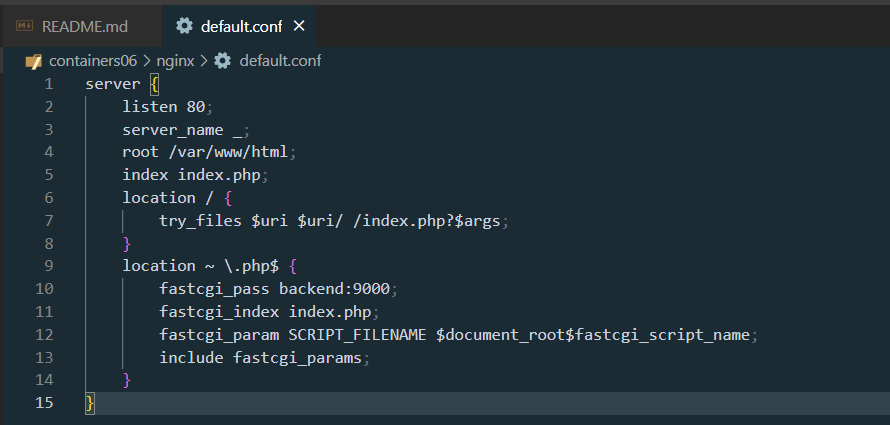
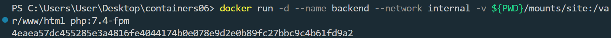

# containers06

IWNO6: Взаимодействие контейнеров

## Цель работы

Выполнив данную работу смогу управлять взаимодействием нескольких контейнеров.

## Задание

Создать php приложение на базе двух контейнеров: nginx, php-fpm.

## Подготовка

Для выполнения данной работы необходимо иметь установленный на компьютере Docker.

Для выполнения работы необходимо иметь опыт выполнения лабораторной работы №3.

## Выполнение

Создаю репозиторий containers06 и скопирую его себе на компьютер.


В директории containers06 создаю директорию `mounts/site`. В данную директорию перепишу сайт на php, созданный в рамках предмета по php.


Создаю файл `.gitignore` в корне проекта и добавляю в него строки:

```
# Ignore files and directories
mounts/site/*
```


Создаю в директории `containers06` файл `nginx/default.conf` со следующим содержимым:

```bash
server {
    listen 80;
    server_name _;
    root /var/www/html/public;  # Корень - папка public
    index index.php;

    location / {
        try_files $uri $uri/ /index.php?$args;
    }

    location ~ \.php$ {
        fastcgi_pass backend:9000;
        fastcgi_index index.php;
        fastcgi_param SCRIPT_FILENAME $document_root$fastcgi_script_name;
        include fastcgi_params;
    }

    # Обработка запросов к файлам в src/
    location /src/ {
        alias /var/www/html/src/;
        try_files $uri $uri/ /index.php?$args;

        location ~ \.php$ {
            fastcgi_pass backend:9000;
            fastcgi_param SCRIPT_FILENAME $request_filename;
            include fastcgi_params;
        }
    }
}
```



## Запуск

Создаю сеть `internal` для контейнеров.

```bash
docker network create internal
```


Результат

Сеть internal успешно создана. Проверить список сетей можно командой:

```bash
docker network ls
```

Запуск контейнер бэкенда (PHP-FPM)

Создаю контейнер бэкенда со следующими свойствами:

    - на базе образа php:7.4-fpm;
    - к контейнеру примонтирована директория mounts/site в /var/www/html;
    - работает в сети internal.

Реализация

```bash
docker run -d --name backend --network internal -v ${PWD}/mounts/site:/var/www/html php:7.4-fpm
```



Запуск контейнер frontend (Nginx)

Создаю контейнер frontend со следующими свойствами:

    - на базе образа nginx:1.23-alpine;
    - с примонтированной директорией mounts/site в /var/www/html;
    - с примонтированным файлом nginx/default.conf в /etc/nginx/conf.d/default.conf;
    - порт 8080 контейнера проброшен на порт 80 хоста (изменил порт , так как был занят);
    - работает в сети internal.

Реализация:

```bash
docker run -d --name frontend --network internal -v ${PWD}/mounts/site:/var/www/html -v ${PWD}/nginx/default.conf:/etc/nginx/conf.d/default.conf -p 8080:80 nginx:1.23-alpine
```


контейнеры в графическом интерфейсе Docker


## Тестирование

Проверка состояния контейнеров.

```bash
docker ps
```


Проверяю работу сайта в браузере, перейдя по адресу http://localhost:8080.


## Вопросы:

1.Каким образом в данном примере контейнеры могут взаимодействовать друг с другом?

Через сеть `internal`. Nginx передает PHP-запросы в контейнер `backend` (php-fpm) по имени `backend:9000`.

2.Как видят контейнеры друг друга в рамках сети `internal`?

По именам сервисов (например, `backend` и `frontend`), так как Docker автоматически настраивает DNS в пользовательских сетях.

3.Почему необходимо было переопределять конфигурацию `nginx`?

Чтобы:

- Указать корневую директорию `/var/www/html/public`.
- Настроить передачу PHP-запросов в контейнер `backend`.
- Обработать пути к файлам в `src/`.

## Вывод

Данная работа позволила получить практическое понимание использования Docker-контейнеров для создания модульного веб-приложения. В ходе выполнения были освоены следующие навыки:

- Настройка внутренней сети для взаимодействия контейнеров.

- Подключение общих томов для обмена файлами между контейнерами.

- Кастомизация конфигурации Nginx для интеграции с PHP-FPM.

- Тестирование и отладка приложения в контейнеризированной среде.

Итогом стала работоспособная PHP-приложение, доступное по адресу http://localhost:8080, которое наглядно демонстрирует принцип разделения обязанностей:

    - Nginx отвечает за обработку HTTP-запросов и статический контент.

    - PHP-FPM выполняет интерпретацию PHP-скриптов.

Подобный подход обеспечивает гибкость и масштабируемость, что особенно важно для сложных проектов.

## Библиография

- Курс Moodle USM, Контейнеризация и виртуализация

- Документация docker – https://docs.docker.com/

- Markdown Guide – https://www.markdownguide.org/
